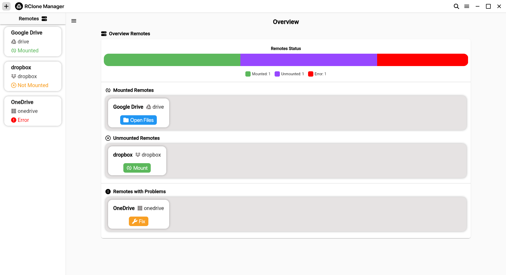
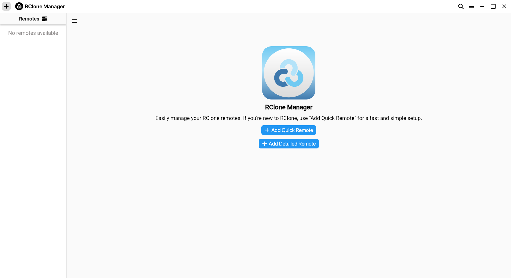
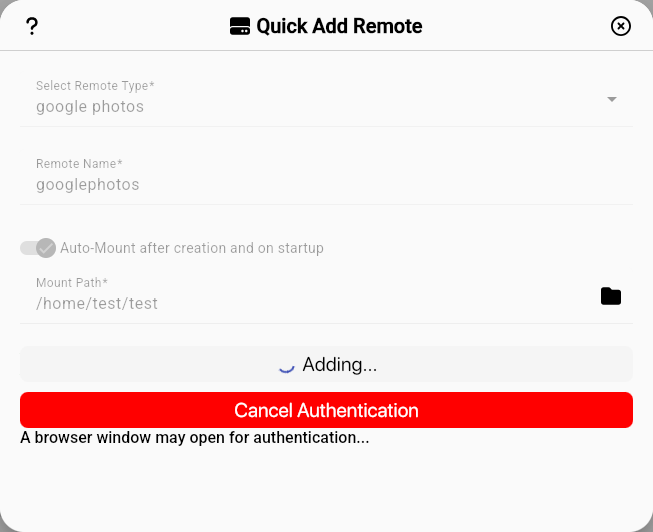
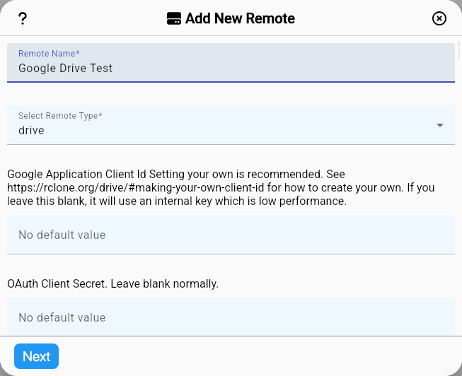

<h1 align="center">
  <br>
  <a></a>
  <br>
  Rclone Manager
  <br>
</h1>

Rclone Manager is a **cross-platform (For Now Only Linux) GUI application** designed to help users **manage Rclone remotes** efficiently.  

🌟 **Inspired by GTK**, it features a **modern, intuitive interface** built with **Tauri and Angular**, allowing users to configure, mount, and manage cloud storage remotes via Rclone with ease.


🚧 **Under active development!** Expect frequent updates and improvements.

---

## 📸 Screenshots  

<details>
  <summary>Click to expand screenshots 📷</summary>

### Home Screen  
  
  

### Add Remote  
  
  

🚧 *More screenshots coming soon!*
</details>


---

## 🚀 Features
- **GTK-Inspired Design** – A clean and intuitive UI inspired by **modern GTK applications**.
- **Add, Edit, and Remove Remotes** – Manage cloud storage configurations effortlessly.
- **Quick Remote Adding Support with OAuth** – Authenticate cloud services easily.
- **Dynamic Remote Configurations** – Supports Google Drive, AWS S3, OneDrive, Dropbox, and more.
- **Mount Management** – Mount/unmount remotes with **native execution** or **systemd-based mounting**.
- **Advanced Mount Options** – Configure cache settings, read chunk sizes, and other **VFS options** dynamically.
- **Tray Icon Support** – Quickly access mounted remotes from the system tray.
- **Dark & Light Mode** – **Inspired by GTK**, with a **clean & modern** theme.
- **Cross-Platform Support** – Currently **Linux-only** (Windows/macOS planned).

---

## 📦 Downloads  

You can download the latest release from the **[Releases Page](https://gitlab.com/Hakanbaban53/rclone-manager/-/releases)**.  

🚧 *Currently, only Linux builds are supported. Windows and macOS support is planned for future updates.*

---

## 🛠️ Installation  

### **Prerequisites**  
- **Rclone** ([Download](https://rclone.org/downloads/)) – Required for remote management.  
- **Node.js** – Required for Angular development.  
- **Rust & Cargo** – Required for Tauri.  

### **Development Setup**  
```bash
# Clone the repository
git clone https://gitlab.com/Hakanbaban53/rclone-manager.git
cd rclone-manager

# Install dependencies
npm install

# Run the app in development mode
npm run tauri dev
```
⚠️ **Note:** Running `npm run ng serve` will not work correctly because the app relies on **Tauri APIs** (e.g., for the custom title bar). Always use `npm run tauri dev`.

### **Build for Production**  
```bash
# Build the Tauri application
npm run tauri build
```

---

## 📜 License  

This project is licensed under the **GNU General Public License v3.0 (GPL-3.0)**. See [LICENSE](LICENSE) for details.

---

## 🤝 Contributing  

Contributions are welcome! 🚀  
- Report issues and suggest features via **[GitLab Issues](https://gitlab.com/Hakanbaban53/rclone-manager/issues)**.  
- Submit pull requests to improve the project.  

---

## 📧 Contact  

For questions or feedback, feel free to open an issue on **[GitLab](https://gitlab.com/Hakanbaban53/rclone-manager/issues)**.  

