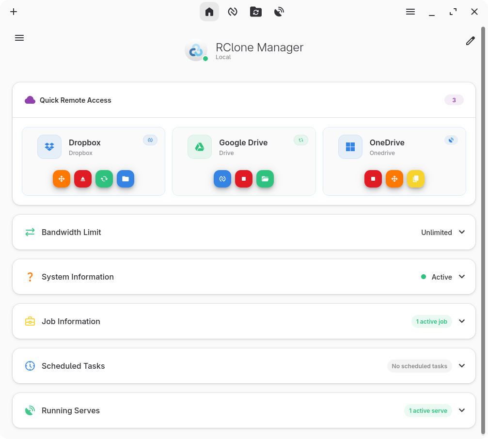
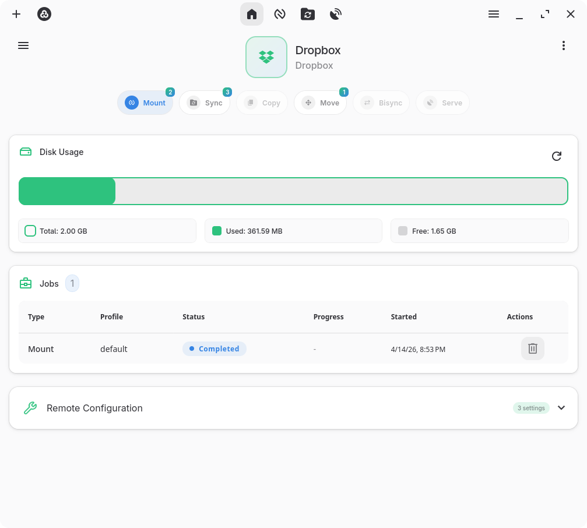
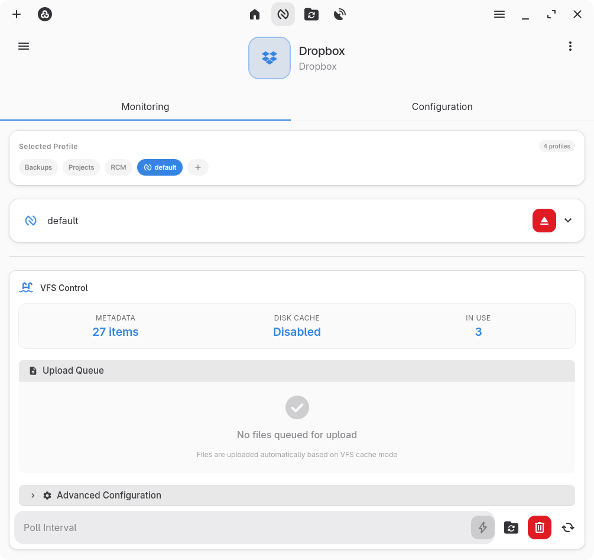
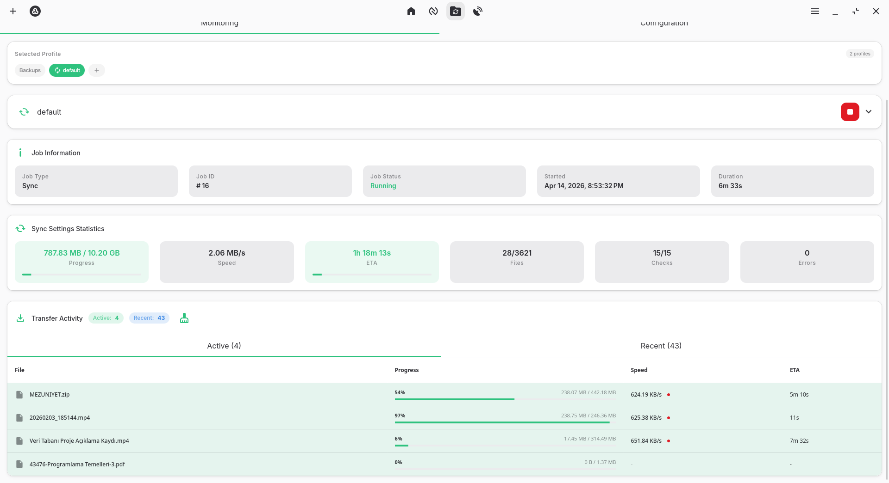
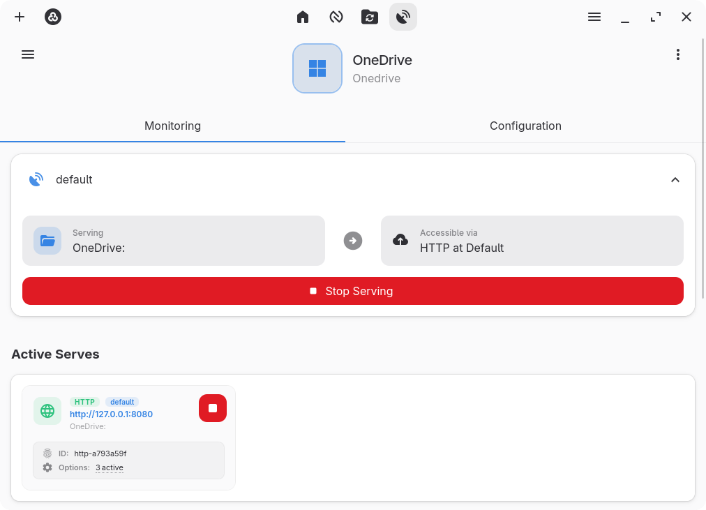

<h1 align="center">
  
  <br>
  RClone Manager
</h1>

<p align="center">
  <b>A powerful, cross-platform GUI for managing Rclone remotes with style and ease.</b><br>
  <i>Built with Angular 20 + Tauri 2 · Linux • Windows • macOS • ARM Support</i>
</p>

<p align="center">
  <a href="https://github.com/Zarestia-Dev/rclone-manager/releases">
    
  </a>
  <a href="https://github.com/Zarestia-Dev/rclone-manager/blob/master/LICENSE">
    
  </a>
  <a href="https://github.com/Zarestia-Dev/rclone-manager/stargazers">
    
  </a>
</p>

---

## Overview

**RClone Manager** is a **modern, cross-platform GUI** that makes managing [Rclone](https://rclone.org/) remotes effortless. Whether you're syncing files across cloud storage providers, mounting remote drives, or performing complex file operations, RClone Manager provides an intuitive interface that simplifies even the most advanced Rclone features.

<div align="center">
  
> ### 🌐 **Looking for Headless Mode?**
> 
> Check out **[RClone Manager Headless](headless/README.md)** – Run as a web server on Linux servers without a GUI!  
> Perfect for NAS, VPS, and remote systems. Access from any browser. 🚀

</div>

> Regular updates with new features and improvements. Check out our [roadmap](https://github.com/users/Zarestia-Dev/projects/2) to see what's coming next!

---

## 🎨 Design Philosophy

**Beautiful by design.** A unique blend of **GTK styling**, **Angular Material**, and **FontAwesome icons** creates a clean, minimalist interface that feels at home on any platform while maintaining a modern, responsive experience.

---

## 📸 Screenshots

<p align="center">
  
</p>
<p align="center">

|                                Home                                 |                             Remote Overview                             |                             Mount Control                             |
| :-----------------------------------------------------------------: | :---------------------------------------------------------------------: | :-------------------------------------------------------------------: |
|  |  |  |

|                            Job Watcher                            |                             Serve Control                             |                          Dark Mode                          |
| :---------------------------------------------------------------: | :-------------------------------------------------------------------: | :---------------------------------------------------------: |
|  |  |  |

</p>

<p align="center">
  <em>Seamlessly switches between light and dark modes to match your system preferences.</em>
</p>

---

## 🚀 Features

### 🎯 Core

- 🛠 Manage remotes end-to-end (add/edit/delete/clone) with OAuth or interactive config
- 🔑 Secure by default (keyring storage, encrypted exports) plus scheduled jobs and quick import/export
- 📡 Works with all major clouds (Drive, OneDrive, Dropbox, S3, iCloud, Wasabi, B2, …)

### ⚡ Operations

- 📁 Mount and serve remotes; sync, copy, move and bisync between any two locations
- 🎯 One-tap primary actions per remote; monitor jobs live with speeds and progress

### 🎨 Experience

- 🌗 Adaptive light/dark theming with GTK-inspired Material UI
- 🖥 Tray controls, smart notifications, and full VFS/flag tuning when you need it

### 🌍 Platforms

- Linux, Windows, macOS; responsive layout for desktop and mobile

### 🔧 Power Tools

- Auto-update, terminal-friendly flows, metered-connection warnings, global shortcuts, mount watcher

---

## 📦 Downloads

Install RClone Manager from your favorite package manager.

#### Linux

| Repository          | Version                                                                                                                                                                                 | Install Command                                                                                                                                                             |
| :------------------ | :-------------------------------------------------------------------------------------------------------------------------------------------------------------------------------------- | :-------------------------------------------------------------------------------------------------------------------------------------------------------------------------- |
| **AUR**             | [](https://aur.archlinux.org/packages/rclone-manager)                                                | `yay -S rclone-manager`                                                                                                                                                     |
| **AUR (Git)**       | [](https://aur.archlinux.org/packages/rclone-manager-git)                                        | `yay -S rclone-manager-git`                                                                                                                                                 |
| **Direct Download** | [](https://github.com/Zarestia-Dev/rclone-manager/releases/latest) | <a href="https://github.com/Zarestia-Dev/rclone-manager/releases/latest"></a> |
| **Flathub**         | [](https://flathub.org/en/apps/io.github.zarestia_dev.rclone-manager)  | `flatpak install io.github.zarestia_dev.rclone-manager`                                                                                                                     |

<p align="left">
  <a href="https://flathub.org/en/apps/io.github.zarestia_dev.rclone-manager">
    
  </a>
</p>

> **Note:** For Linux installation instructions and troubleshooting, check the installation guide: [Installation - Linux](https://github.com/Zarestia-Dev/rclone-manager/wiki/Installation-Linux)

#### macOS

| Repository          | Version                                                                                                                                                                                 | Install Command                                                                                                                                                             |
| :------------------ | :-------------------------------------------------------------------------------------------------------------------------------------------------------------------------------------- | :-------------------------------------------------------------------------------------------------------------------------------------------------------------------------- |
| **Homebrew**        |                                                                                                                         | `brew install --cask xxxxxxxxxxxxxxxxxxxxxx`                                                                                                                                |
| **Direct Download** | [](https://github.com/Zarestia-Dev/rclone-manager/releases/latest) | <a href="https://github.com/Zarestia-Dev/rclone-manager/releases/latest"></a> |

> **Note:** For macOS app launch instructions and troubleshooting, check the installation guide: [Installation - macOS](https://github.com/Zarestia-Dev/rclone-manager/wiki/Installation-macOS)

#### Windows

| Repository          | Version                                                                                                                                                                                 | Install Command                                                                                                                                                             |
| :------------------ | :-------------------------------------------------------------------------------------------------------------------------------------------------------------------------------------- | :-------------------------------------------------------------------------------------------------------------------------------------------------------------------------- |
| **Chocolatey**      | [](https://community.chocolatey.org/packages/rclone-manager)                                         | `choco install rclone-manager`                                                                                                                                              |
| **Scoop**           | [](https://github.com/ScoopInstaller/Extras/blob/master/bucket/rclone-manager.json) | `scoop bucket add extras` then `scoop install rclone-manager`                                                                                                               |
| **Winget**          |                                                                                  | `winget install RClone-Manager.rclone-manager`                                                                                                                              |
| **Direct Download** | [](https://github.com/Zarestia-Dev/rclone-manager/releases/latest) | <a href="https://github.com/Zarestia-Dev/rclone-manager/releases/latest"></a> |

---

### 🛠️ Runtime Requirements

**RClone Manager** will guide you through installing any missing dependencies on first run. However, you can pre-install:

#### Required

- **[Rclone](https://rclone.org/downloads/)** – The core tool for remote management (can be installed via the app)

#### Optional (for mounting)

- **Linux/macOS:** [FUSE](https://github.com/libfuse/libfuse) – Usually pre-installed on most distributions
- **Windows:** [WinFsp](https://github.com/billziss-gh/winfsp) – Automatically prompted for installation if missing
- **macOS:** Mount plugin – Automatically installed by the app when needed

#### Optional (for encrypted exports)

- **[7-Zip](https://www.7-zip.org/)** – For password-protected configuration backups

---

## 🛠️ Development

### 🔧 Tech Stack

- **Frontend**: Angular 20 + Angular Material + FontAwesome
- **Backend**: Tauri 2 (Rust)
- **Styling**: Custom GTK-inspired theming with responsive design
- **Architecture**: Modern component-based with reactive state management

### Prerequisites for Building

- **[Node.js](https://nodejs.org/)** (v18 or later)
- **[Rust](https://www.rust-lang.org/tools/install)** (latest stable)
- **[Cargo](https://doc.rust-lang.org/cargo/)** (comes with Rust)
- Platform-specific build tools (see [Tauri prerequisites](https://tauri.app/start/prerequisites/))

### Development Setup

```bash
# Clone the repository
git clone https://github.com/Zarestia-Dev/rclone-manager.git
cd rclone-manager

# Install dependencies
npm install

# Start development server
npm run tauri dev
```

⚠️ **Important:** Always use `npm run tauri dev` instead of `ng serve`, as the app requires Tauri APIs.

### Building for Production

```bash
# Build for your current platform
npm run tauri build

# The built application will be in src-tauri/target/release/
```

### Linting & Formatting

- See [**LINTING.md**](LINTING.md) for detailed instructions on linting and formatting the codebase.

---

## 🐞 Known Issues

Known bugs and technical limitations are tracked in two places:

- 📄 See [**ISSUES.md**](ISSUES.md) for detailed explanations of platform-specific issues (e.g. MacOS App Damaged)
- 📌 Visit our [**GitHub Project Board**](https://github.com/users/Zarestia-Dev/projects/2) for open bugs and upcoming fixes

---

## 🗺️ Roadmap

We organize development on our [**GitHub Project Board**](https://github.com/users/Zarestia-Dev/projects/2) — track features, bugs, and long-term goals.

> 🧠 **Want to influence the direction?** Star the repo, watch the project board, and share your ideas in [Discussions](https://github.com/Zarestia-Dev/discussions) or [Issues](https://github.com/Zarestia-Dev/rclone-manager/issues)!

---

## 🤝 Contributing

We welcome contributions from developers of all skill levels! Here's how you can help:

### Ways to Contribute

- 🐛 **Report Bugs** – Found an issue? [Open a bug report](https://github.com/Zarestia-Dev/rclone-manager/issues/new?template=bug_report.md)
- 💡 **Suggest Features** – Have an idea? [Share it with us](https://github.com/Zarestia-Dev/rclone-manager/issues/new?template=feature_request.md)
- 📖 **Improve Documentation** – Help make our docs clearer and more comprehensive
- 🔧 **Submit Pull Requests** – Fix bugs or implement features (see development setup above)
- 🌍 **Translate** – Help make RClone Manager available in your language (coming soon)
- ⭐ **Spread the Word** – Star the repo, share with friends, write blog posts

### Contribution Guidelines

1. Fork the repository and create a feature branch
2. Follow the existing code style and linting rules
3. Test your changes thoroughly on your target platform
4. Write clear commit messages
5. Submit a pull request with a detailed description

> 📝 See our [CONTRIBUTING.md](CONTRIBUTING.md) guide (coming soon) for detailed guidelines

---

## 📜 License

Licensed under the **[GNU GPLv3](LICENSE)**.

You are free to use, modify, and distribute this software under the terms of the GPL v3 license. See the [LICENSE](LICENSE) file for full details.

---

## 📬 Support & Contact

### Get Help

- 💬 [GitHub Discussions](https://github.com/Zarestia-Dev/rclone-manager/discussions) – Ask questions and chat with the community
- 🐛 [Issue Tracker](https://github.com/Zarestia-Dev/rclone-manager/issues) – Report bugs or request features
- 📖 [Documentation](https://github.com/Zarestia-Dev/rclone-manager/wiki) – Guides and tutorials

### Stay Updated

- ⭐ Star the repository to get notifications about new releases
- 👀 Watch the repo for all updates and discussions
- 🔔 Enable release notifications to be the first to know about new versions

---

<p align="center">
  Made with ❤️ by the Zarestia Dev Team<br>
  <sub>Powered by Rclone | Built with Angular & Tauri</sub>
</p>
