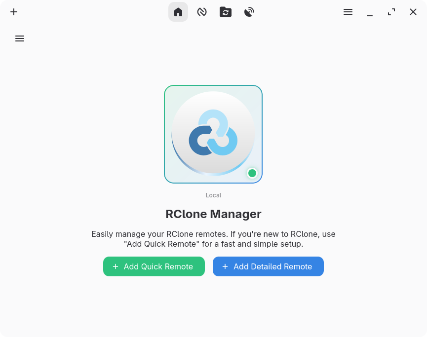
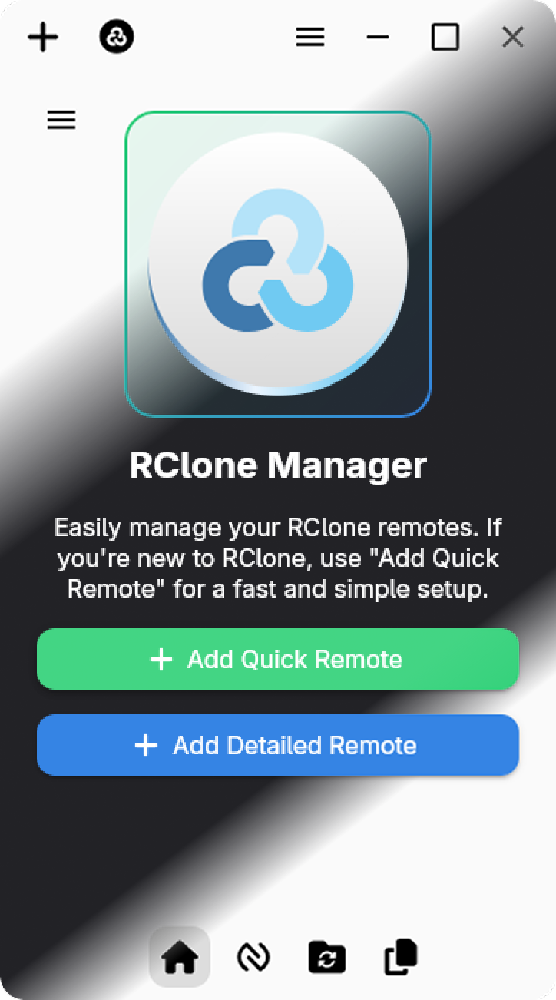

<h1 align="center">
  
  <br>
  RClone Manager
</h1>

<p align="center">
  <b>Cross-platform GUI for managing RClone remotes with style.</b><br>
  <i>Built with Angular + Tauri · Linux support (Windows/macOS planned)</i>
</p>

---

## 🌐 Overview

**RClone Manager** is a **cross-platform (currently Linux-only)** GUI application to help users manage [RClone](https://rclone.org/) remotes with a modern interface.

> ⚠️ **Actively developed** – Expect frequent updates and improvements.

---

## 🎨 Design Philosophy

💡 **Caotic Design** – A unique mix of **GTK styling**, **Angular Material**, and **FontAwesome**, creating a minimalist yet modern look.

---

## 📸 Screenshots

<p align="center">
  <strong>💻 Desktop</strong><br/>
  
</p>

<p align="center">
  <strong>📱 Mobile</strong><br/>
  
</p>

<p align="center">
  <em>Both light and dark modes are shown with a diagonal split for visual comparison.</em>
</p>


---

## 🚀 Features

- 🎨 **User-Friendly Theme** – Enjoy a clean, intuitive interface designed for ease of use, making remote management accessible for everyone.
- 🛠 **Remote Management** – Add, edit, and delete remotes easily.
- 🔐 **OAuth Support** – Authenticate with popular providers effortlessly.
- ☁️ **Supported Remotes** – Nearly all Rclone remotes are supported, including:
  - Google Drive
  - Dropbox
  - OneDrive
  - S3-compatible services
  - And many more!
- ⚙️ **Advanced VFS Options** – Tune caching, read sizes, and other performance options.
- 🖥 **Tray Icon Support** – Quick access to your remotes from the system tray.
- 🌗 **Light & Dark Modes** – GTK-inspired themes with a modern, responsive layout.
- 🧪 **Cross-Platform Architecture** – Tauri + Angular. **Linux ready**, Windows/macOS coming soon.

---

## 🔧 Tech Stack

- **Frontend**: Angular + Angular Material + FontAwesome
- **Backend**: Tauri (Rust)
- **Styling**: GTK-inspired custom theming

---

## 📦 Downloads

👉 Get the latest release from:

- 🔗 [GitHub Releases](https://github.com/Hakanbaban53/rclone-manager/releases)

> 🚧 Only Linux builds are currently provided. Windows and macOS support is on the roadmap.

---

## 🛠️ Installation

### 🔍 Prerequisites

Make sure you have the following installed:

- **[RClone](https://rclone.org/downloads/):** Required for remote management.
- **[Fuse](https://github.com/libfuse/libfuse):** Needed for mounting remotes on Linux/macOS.
- **[WinFsp](https://github.com/billziss-gh/winfsp):** Needed for mounting remotes on Windows.
- **[Node.js](https://nodejs.org/en/download/):** Required for Angular development and running the frontend.
- **[Rust](https://www.rust-lang.org/tools/install):** Required for Tauri (backend) development.
- **[Cargo](https://doc.rust-lang.org/cargo/getting-started/installation.html):** Rust’s package manager, required for Tauri.

### 💻 Development Setup

```bash
# Clone from GitHub
git clone https://github.com/Hakanbaban53/rclone-manager.git
cd rclone-manager

# Or from GitLab
git clone https://gitlab.com/Hakanbaban53/rclone-manager.git
cd rclone-manager

# Install dependencies
npm install

# Run the app
npm run tauri dev
```

⚠️ **Note:** Do not use `ng serve` — the app depends on **Tauri APIs**.

### 📦 Build for Production

```bash
npm run tauri build
```

---

## 🐛 Known Issues

You can find known issues and bugs in the [ISSUES.md](ISSUES.md) file.
---

## 📜 Roadmap

### 🔜 Short-Term Goals _(Next few releases)_

- [ ] **Windows & macOS Support**
      Package and test Rclone Manager for Windows and macOS.

- [ ] **Notification System**
      Implement a notification system for background tasks and updates.

- [ ] **Built-in Sync & Copy Support**
      Provide GUI options for `rclone sync` and `rclone copy` with common settings.

- [ ] **Enhanced Remote Management**
      Improve the interface for creating, editing, and organizing remotes.

- [ ] **User Interface Enhancements**
      Refine layout, icons, and theming for a smoother user experience.

- [ ] **Feature Requests & Feedback Integration**
      Review community input and prioritize highly requested features.

- [ ] **Basic Testing & QA**
      Implement initial test coverage and manual platform validation.

---

### 🚀 Long-Term Goals _(Future milestones)_

- [ ] **Mobile Support**
      Explore options for Android and iOS compatibility.

- [ ] **Performance Optimization**
      Streamline backend communication, reduce resource usage, and optimize startup time.

- [ ] **Localization / Internationalization**
      Add multi-language support to reach a broader user base.

- [ ] **Accessibility Improvements**
      Ensure compatibility with screen readers, keyboard-only navigation, and accessibility standards.

- [ ] **Advanced Rclone Features**
      Expose more advanced Rclone functionalities (like filters, bandwidth limits, scheduling).

- [ ] **Integration with Other Tools**
      Allow interaction with file managers, cloud dashboards, or automation tools.

- [ ] **Comprehensive Testing & QA**
      Establish robust automated testing pipelines and continuous integration for stability across platforms.

---

## 🧑‍💻 Contributing

Contributions welcome! 🚀

- Report bugs & suggest features on:
  - [GitHub Issues](https://github.com/Hakanbaban53/rclone-manager/issues)
  - [GitLab Issues](https://gitlab.com/Hakanbaban53/rclone-manager/issues)
- Submit pull requests and help improve the project!

---

## 📜 License

This project is licensed under the **[GNU GPLv3](LICENSE)**.

---

## 📬 Contact

Have questions or ideas? Reach out via:

- [GitHub Issues](https://github.com/Hakanbaban53/rclone-manager/issues)
- [GitLab Issues](https://gitlab.com/Hakanbaban53/rclone-manager/issues)
