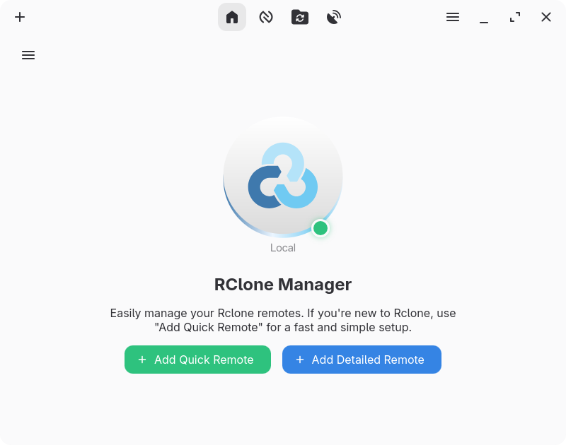
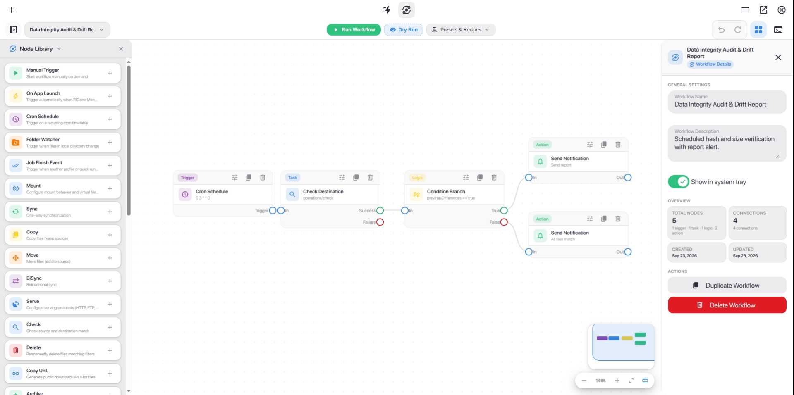
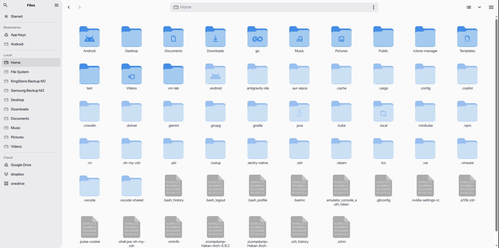

  

<h1 align="center">RClone Manager</h1>

  <a href="README.md">🇺🇸 English</a> •
  <a href="README.tr-TR.md">🇹🇷 Türkçe</a> •
  <a href="README.zh-CN.md">🇨🇳 简体中文</a> •
  <a href="README.zh-TW.md">🇹🇼 繁體中文</a> •
  <a href="README.fr-FR.md">🇫🇷 Français</a> •
  <a href="README.es-ES.md">🇪🇸 Español</a> •
  <a href="README.pt-BR.md">🇧🇷 Português-Brasil</a> •
  <a href="README.ru-RU.md">🇷🇺 Русский</a> •
  <a href="README.ja-JP.md">🇯🇵 日本語</a> •
  <a href="CONTRIBUTING.md#adding-translations">Помочь с переводом</a> •
  <a href="https://crowdin.com/project/rclone-manger">Crowdin</a>

  <b>Мощный кроссплатформенный графический интерфейс для удобного управления удалёнными хранилищами Rclone.</b> 
  <i>Создан с использованием Angular 22 и Tauri · Linux • Windows • macOS • Android (бета) • Поддержка ARM</i>

  

  
  
  
  
  
  

---

## Обзор

**RClone Manager** упрощает управление файлами и синхронизацию с удалёнными хранилищами. Используя Rclone в качестве основы, приложение предоставляет полноценную настольную среду со встроенным файловым менеджером **Nautilus** для переноса, монтирования и публикации удалённых файлов.

- 📂 **Файловый менеджер Nautilus:** просмотр, редактирование, перемещение, копирование, переименование и удаление удалённых файлов.
- 👁️ **Просмотр файлов:** встроенный просмотр видео, изображений, PDF, аудио и текстовых файлов.
- ⚡ **Визуальные рабочие процессы (Workflows):** проектирование и автоматизация многоэтапных конвейеров на интерактивном холсте с нодами, расписаниями cron, отслеживанием папок и мгновенными оповещениями.
- 🚀 **Быстрые запуски (Quick Runs):** запуск облачных операций в один клик и управление пресетами параметров CLI из интерактивной сетки карточек.
- ⚙️ **Монтирование и серверы:** удобное управление подключениями и серверами WebDAV, SFTP, HTTP и FTP.
- 🔄 **Наблюдение за заданиями:** контроль передачи файлов и ограничение пропускной способности в реальном времени.
- 📱 **Android SAF и DocumentsProvider:** встроенная поддержка Storage Access Framework (SAF) и монтирование через VFS мост без root и FUSE для прямого доступа к облачным хранилищам из системного проводника.
- 🌐 **Серверный режим:** используйте [RClone Manager Headless](headless/README.md) для запуска в качестве веб-сервера на VPS или NAS.

---

## Скриншоты

  <picture>
    <source media="(prefers-color-scheme: dark)" srcset="assets/dark-ui.png">
    <source media="(prefers-color-scheme: light)" srcset="assets/desktop-ui.png">
    
  </picture>
   
  Панель управления - Быстрые запуски, монтирования и обзор удалённых хранилищ

  
   
  Редактор рабочих процессов - Проектируйте и автоматизируйте многоэтапные облачные конвейеры на интерактивном холсте с нодами

  
   
  Nautilus - Просматривайте, передавайте и управляйте файлами на всех удалённых хранилищах

  <i>📖 Больше примеров интерфейса доступно в <b><a href="https://hakanismail.info/zarestia/rclone-manager/docs/gallery">галерее Wiki</a></b>.</i>

---

## Установка и загрузка

Установите RClone Manager с помощью предпочитаемого пакетного менеджера или загрузите готовые файлы со страницы [Releases](https://github.com/Zarestia-Dev/rclone-manager/releases).

### Linux

| Источник            | Версия                                                                                                                                                                                 | Команда установки или загрузка                                                                                                  |
| :------------------ | :------------------------------------------------------------------------------------------------------------------------------------------------------------------------------------- | :------------------------------------------------------------------------------------------------------------------------------ |
| **AUR**             |                                    | `yay -S rclone-manager`                                                                                                         |
| **AUR (Git)**       |                            | `yay -S rclone-manager-git`                                                                                                     |
| **Flathub**         |     | `flatpak install io.github.zarestia_dev.rclone-manager`                                                                         |
| **Прямая загрузка** |  | [Последние выпуски: .deb, .rpm, .AppImage и переносимый tar.gz](https://github.com/Zarestia-Dev/rclone-manager/releases/latest) |

> 📚 **Руководство:** [Установка в Linux](https://hakanismail.info/zarestia/rclone-manager/docs/installation-linux) - устранение проблем с Flatpak, снимками и другими компонентами.

### macOS

| Источник            | Версия                                                                                                                                                                                                        | Команда установки или загрузка                                                                             |
| :------------------ | :------------------------------------------------------------------------------------------------------------------------------------------------------------------------------------------------------------ | :--------------------------------------------------------------------------------------------------------- |
| **Homebrew**        |  | `brew tap Zarestia-Dev/zarestia && brew trust Zarestia-Dev/zarestia && brew install --cask rclone-manager` |
| **Прямая загрузка** |                         | [Установщик DMG](https://github.com/Zarestia-Dev/rclone-manager/releases/latest)                           |

> 📚 **Руководство:** [Установка в macOS](https://hakanismail.info/zarestia/rclone-manager/docs/installation-macos) - настройка macFUSE и устранение блокировок Gatekeeper.

### Windows

| Источник            | Версия                                                                                                                                                                                                           | Команда установки или загрузка                                                                   |
| :------------------ | :--------------------------------------------------------------------------------------------------------------------------------------------------------------------------------------------------------------- | :----------------------------------------------------------------------------------------------- |
| **Winget**          |  | `winget install RClone-Manager.rclone-manager`                                                   |
| **Chocolatey**      |                                               | `choco install rclone-manager`                                                                   |
| **Scoop**           |                    | `scoop bucket add extras && scoop install rclone-manager`                                        |
| **Прямая загрузка** |                            | [Установщик или переносимый EXE](https://github.com/Zarestia-Dev/rclone-manager/releases/latest) |

> 📚 **Руководство:** [Установка в Windows](https://hakanismail.info/zarestia/rclone-manager/docs/installation-windows) - требования WinFsp для монтирования и сведения о SmartScreen.

### Android (Бета)

| Источник            | Версия                                                                                                                                                                                 | Команда установки или загрузка                                                                                      |
| :------------------ | :------------------------------------------------------------------------------------------------------------------------------------------------------------------------------------- | :------------------------------------------------------------------------------------------------------------------ |
| **Прямая загрузка** |  | [Скачать APK (arm64-v8a, armeabi-v7a, x86_64, x86)](https://github.com/Zarestia-Dev/rclone-manager/releases/latest) |

> 📱 **Storage Access Framework (SAF):** включает встроенный `DocumentsProvider` (`RcloneDocumentsProvider`) и VFS-мост монтирования, открывая доступ к удалённым хранилищам для системного проводника Android и сторонних приложений без root-прав и `/dev/fuse`.
>
> 📚 **Руководство:** [Wiki: Поддержка Android (Бета)](https://hakanismail.info/zarestia/rclone-manager/docs/configuration-android) (Подробности движка Go / librclone, провайдер SAF и настройка)

> 🛠️ **Системные требования:** для монтирования дисков необходимы WinFsp в Windows, macFUSE в macOS или FUSE3 в Linux. При отсутствии Rclone приложение загружает его автоматически. Подробности доступны в разделе [системных требований](https://hakanismail.info/zarestia/rclone-manager/docs/Installation#%EF%B8%8F-dependencies).

---

## Разработка и поддержка

- **Сборка из исходного кода:** используйте [руководство по сборке](https://hakanismail.info/zarestia/rclone-manager/docs/building).
- **Качество кода:** правила оформления описаны в файле [LINTING.md](LINTING.md).
- **Устранение проблем:** посетите [Wiki](https://hakanismail.info/zarestia/rclone-manager/docs/troubleshooting) или ознакомьтесь с файлом [ISSUES.md](ISSUES.md).

---

## Участие в разработке

Приветствуются любые виды помощи проекту.

- 🌍 **Переводы:** присоединитесь к [проекту Crowdin](https://crowdin.com/project/rclone-manger) или прочитайте [руководство по переводу](CONTRIBUTING.md#adding-translations).
- 🐛 **Ошибки и предложения:** создайте [issue](https://github.com/Zarestia-Dev/rclone-manager/issues) или посетите [доску проекта](https://github.com/users/Zarestia-Dev/projects/2).
- 🔧 **Изменения кода:** перед отправкой Pull Request прочитайте [CONTRIBUTING.md](CONTRIBUTING.md).

---

## Лицензия и поддержка

- **Лицензия:** проект распространяется по лицензии [GNU GPLv3](LICENSE) и может свободно использоваться, изменяться и распространяться.
- **Поддержка:** поставьте проекту звезду ⭐ на GitHub.

  Создано командой Zarestia Dev 
  Работает на основе Rclone | Создано с использованием Angular и Tauri

