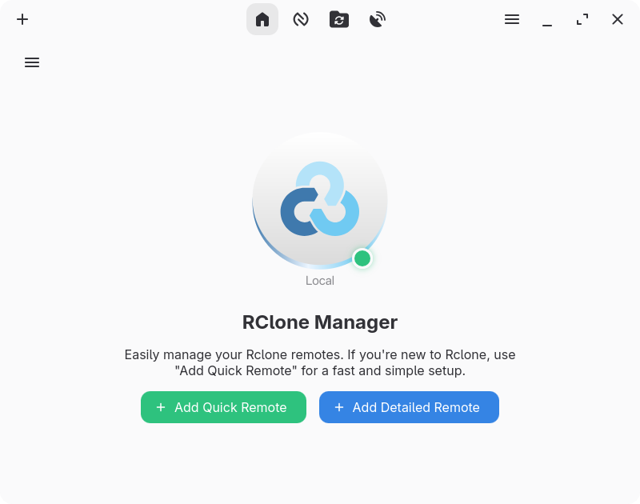
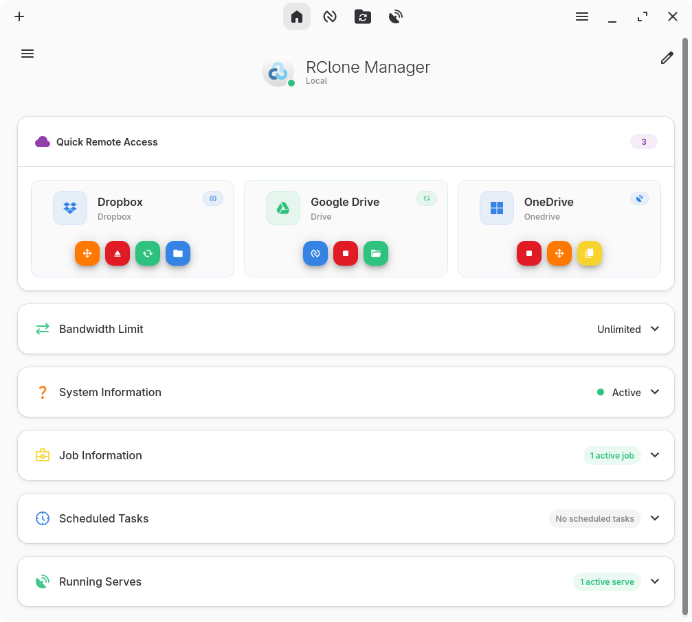
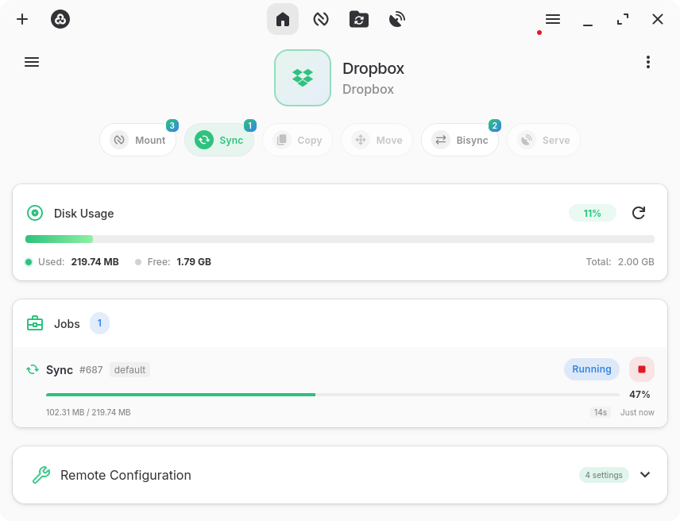
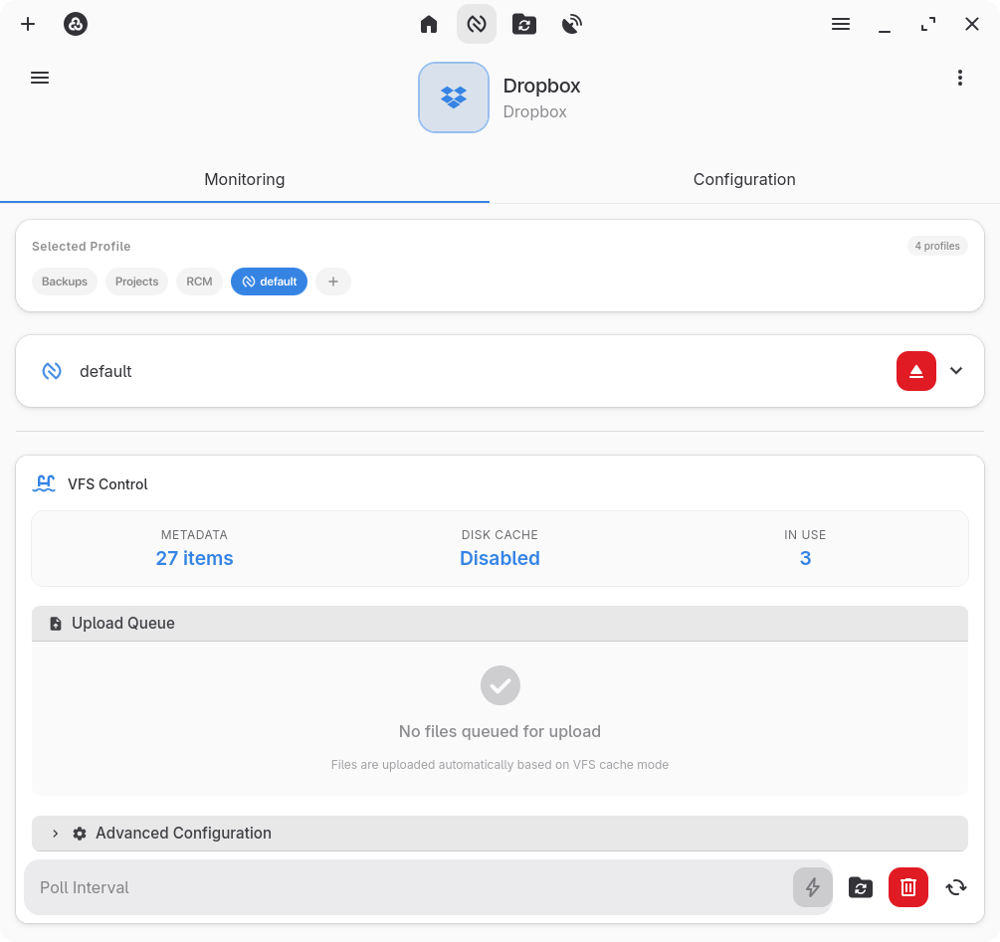
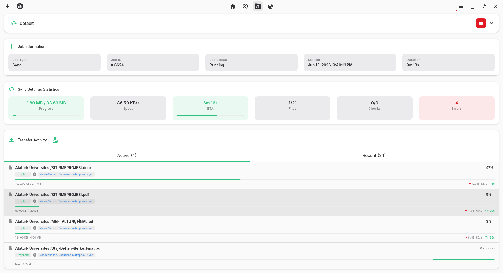
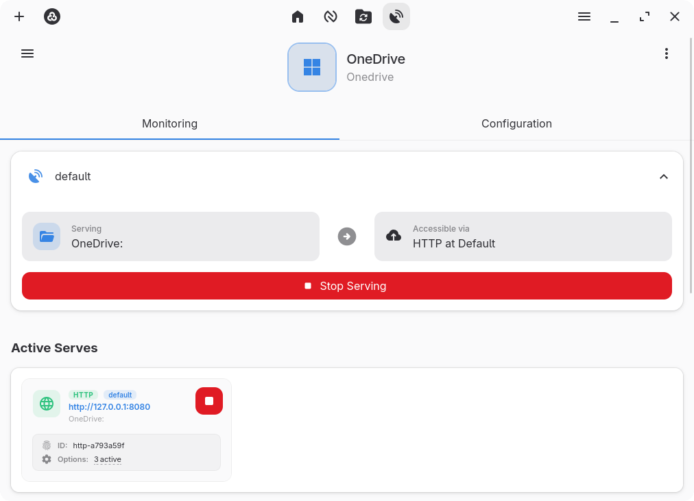
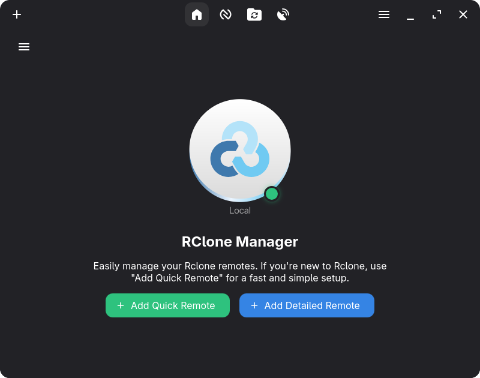
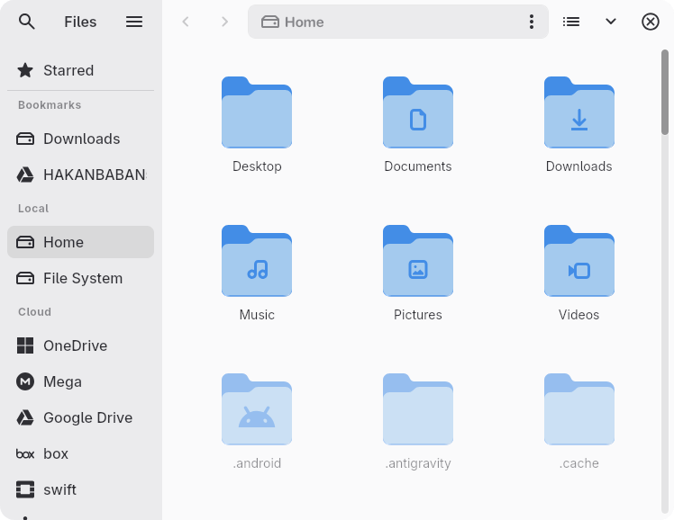
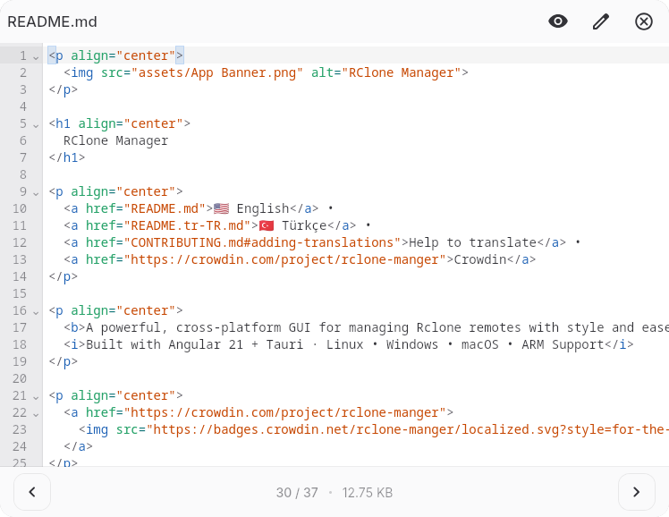

  

<h1 align="center">
  RClone Manager
</h1>

  <a href="README.md">🇺🇸 English</a> •
  <a href="README.tr-TR.md">🇹🇷 Türkçe</a> •
  <a href="CONTRIBUTING.md#adding-translations">Çeviriye Yardım Edin</a> •
  <a href="https://crowdin.com/project/rclone-manger">Crowdin</a>

  <b>Rclone uzak bağlantılarını stil ve kolaylıkla yönetmek için güçlü, çapraz platform bir GUI.</b> 
  <i>Angular 21 + Tauri ile yapıldı · Linux • Windows • macOS • ARM Desteği</i>

  

  
  

  
  

---

## Genel Bakış

**RClone Manager**, [Rclone](https://rclone.org/) uzak bağlantılarını yönetmeyi zahmetsiz hale getiren **modern, çapraz platform bir GUI**'dir. Bulut depolama sağlayıcıları arasında dosya senkronizasyonu, uzak sürücüleri bağlama veya karmaşık dosya işlemleri gerçekleştirme olsun, RClone Manager en gelişmiş Rclone özelliklerini bile basitleştiren sezgisel bir arayüz sunar.

Ayrıca, uzak dosyalarınıza zarif bir şekilde göz atmanızı sağlayan **yerleşik bir dosya yöneticisi (Nautilus)** özelliğine sahiptir. Dosyaları görüntüleyebilir ve düzenleyebilir; dosya ve klasörleri taşıyabilir, silebilir, kopyalayabilir ve yeniden adlandırabilir; ayrıca yeni klasörler oluşturabilirsiniz. Entegre dosya görüntüleyici; videoları, resimleri, PDF'leri, ses ve metin tabanlı dosyaları kolayca önizlemenizi sağlar. Sağ tık menüleri ve özellik modalları dâhil olmak üzere neredeyse tüm dosya işlemlerini destekler!

> Büyük `RC` harfleri `Rclone RC`'yi temsil ediyor.

### 🌐 **Headless Modu mu Arıyorsunuz?**

**[RClone Manager Headless](headless/README.md)** – GUI olmadan Linux sunucularında web sunucusu olarak çalıştırın!  
NAS, VPS ve uzak sistemler için mükemmel. Herhangi bir tarayıcıdan erişin. 🚀

Yeni özellikler ve iyileştirmelerle düzenli güncellemeler. Sırada ne olduğunu görmek için [yol haritamıza](https://github.com/users/Zarestia-Dev/projects/2) göz atın!

---

## 🌍 Çeviri Durumu

| Dil          | Durum                                                                                                                                                                             |
| :----------- | :-------------------------------------------------------------------------------------------------------------------------------------------------------------------------------- |
| English (US) |  |
| Türkçe (TR)  |  |

---

## 📸 Ekran Görüntüleri

  

|                               Ana Sayfa                                |                          Uzak Bağlantı Genel Bakış                           |                             Bağlama Kontrolü                             |
| :--------------------------------------------------------------------: | :--------------------------------------------------------------------------: | :----------------------------------------------------------------------: |
|  |  |  |

|                            Görev İzleyici                            |                             Sunma Kontrolü                             |                          Karanlık Mod                          |
| :------------------------------------------------------------------: | :--------------------------------------------------------------------: | :------------------------------------------------------------: |
|  |  |  |

|                      Nautilus Dosya Yöneticisi                      |                      Dosya Görüntüleyici                      |                                                                |
| :-----------------------------------------------------------------: | :-----------------------------------------------------------: | :------------------------------------------------------------: |
|          |  |                                                                |

---

## 📦 İndirmeler

Favori paket yöneticinizden yükleyin veya doğrudan indirin.

### Linux

| Depo                 | Sürüm                                                                                                                                                                                  | Kurulum Komutu                                                                                                                                                        |
| :------------------- | :------------------------------------------------------------------------------------------------------------------------------------------------------------------------------------- | :-------------------------------------------------------------------------------------------------------------------------------------------------------------------- |
| **AUR**              |                                                 | `yay -S rclone-manager`                                                                                                                                               |
| **AUR (Git)**        |                                         | `yay -S rclone-manager-git`                                                                                                                                           |
| **Flathub**          |  | `flatpak install io.github.zarestia_dev.rclone-manager`                                                                                                               |
| **Doğrudan İndirme** |      |  |

> 📚 **Detaylı Kılavuz:** [Wiki: Kurulum - Linux](https://hakanismail.info/zarestia/rclone-manager/docs/installation-linux)  
> _Flatpak için sorun giderme içerir._

### macOS

| Depo                 | Sürüm                                                                                                                                                                                     | Kurulum Komutu                                                             |
| :------------------- | :---------------------------------------------------------------------------------------------------------------------------------------------------------------------------------------- | :------------------------------------------------------------------------- |
| **Homebrew**         |                                              | `brew tap Zarestia-Dev/zarestia`   `brew install --cask rclone-manager` |
| **Doğrudan İndirme** |       | [DMG İndir](https://github.com/Zarestia-Dev/rclone-manager/releases)       |

> 📚 **Detaylı Kılavuz:** [Wiki: Kurulum - macOS](https://hakanismail.info/zarestia/rclone-manager/docs/installation-macos)  
> _Önemli: "Uygulama Hasarlı" düzeltmesi ve macFUSE kurulumu için bunu okuyun._

### Windows

| Depo                 | Sürüm                                                                                                                                                                                   | Kurulum Komutu                                                                                                                                                        |
| :------------------- | :-------------------------------------------------------------------------------------------------------------------------------------------------------------------------------------- | :-------------------------------------------------------------------------------------------------------------------------------------------------------------------- |
| **Chocolatey**       |                             | `choco install rclone-manager`                                                                                                                                        |
| **Scoop**            |  | `scoop bucket add extras` sonra `scoop install rclone-manager`                                                                                                        |
| **Winget**           |                                                                                  | `winget install RClone-Manager.rclone-manager`                                                                                                                        |
| **Doğrudan İndirme** |       |  |

> 📚 **Detaylı Kılavuz:** [Wiki: Kurulum - Windows](https://hakanismail.info/zarestia/rclone-manager/docs/installation-windows)  
> _WinFsp (bağlama için gerekli) ve SmartScreen talimatlarını içerir._

---

## 🛠️ Sistem Gereksinimleri

RClone Manager çoğu bağımlılığı otomatik olarak yönetir.

- **Rclone:** Eksikse uygulama sizin için indirecektir.
- **Bağlama (İsteğe Bağlı):** **WinFsp** (Windows), **macFUSE** (macOS) veya **FUSE3** (Linux) gerektirir.
- **Detaylar:** Tam uyumluluk notları için **[Wiki: Sistem Gereksinimleri](https://hakanismail.info/zarestia/rclone-manager/docs/installation#system-requirements)** sayfasına bakın.

---

## 🛠️ Geliştirme

Kaynaktan derleme (Masaüstü, Headless, Docker veya Flatpak) için lütfen **[Derleme Kılavuzu](https://hakanismail.info/zarestia/rclone-manager/docs/building)**'na bakın.

### Linting & Formatlama

- Kod kalitesini koruma talimatları için [**LINTING.md**](LINTING.md) dosyasına bakın.

---

## 🐞 Sorun Giderme

Bir sorunla mı karşılaştınız?

1.  Yaygın düzeltmeler için **[Sorun Giderme Wiki](https://hakanismail.info/zarestia/rclone-manager/docs/troubleshooting)** sayfasına bakın (Bağlama hataları, İzinler, Uygulama Başlatma sorunları).
2.  Platform özel bilinen sınırlamalar için [**ISSUES.md**](ISSUES.md) dosyasına bakın.
3.  Üzerinde çalıştığımız şeyleri görmek için **[GitHub Proje Panosu](https://github.com/users/Zarestia-Dev/projects/2)**'nu ziyaret edin.

---

## 🤝 Katkıda Bulunma

Katkıları memnuniyetle karşılıyoruz! İşte nasıl yardım edebilirsiniz:

- 🌍 **Çevirmeye Yardım Edin** – [Çeviri Kılavuzuna](CONTRIBUTING.md#adding-translations) bakın
- 🐛 **Hata Bildirin** – [Hata raporu açın](https://github.com/Zarestia-Dev/rclone-manager/issues/new?template=bug_report.md)
- 💡 **Özellik Önerin** – [Fikirlerinizi paylaşın](https://github.com/Zarestia-Dev/rclone-manager/issues/new?template=feature_request.md)
- 📖 **Belgeleri İyileştirin** – [Dökümantasyonumuzu](https://hakanismail.info/zarestia/rclone-manager/docs) daha net hale getirmemize yardımcı olun
- 🔧 **PR Gönderin** – [CONTRIBUTING.md](CONTRIBUTING.md) dosyasına bakın
- 💬 **Tartışın** – [GitHub Tartışmalarına](https://github.com/Zarestia-Dev/rclone-manager/discussions) katılın

---

## 📜 Lisans

**[GNU GPLv3](LICENSE)** altında lisanslanmıştır – kullanmak, değiştirmek ve dağıtmak serbesttir.

---

## ⭐ Projeyi Destekleyin

- Sürümlerden haberdar olmak için repo'yu **Yıldızlayın** ve **İzleyin**
- Arkadaşlarınızla paylaşın!

---

  Zarestia Dev Ekibi tarafından ❤️ ile yapıldı 
  Rclone ile Desteklenmektedir | Angular & Tauri ile Yapılmıştır

